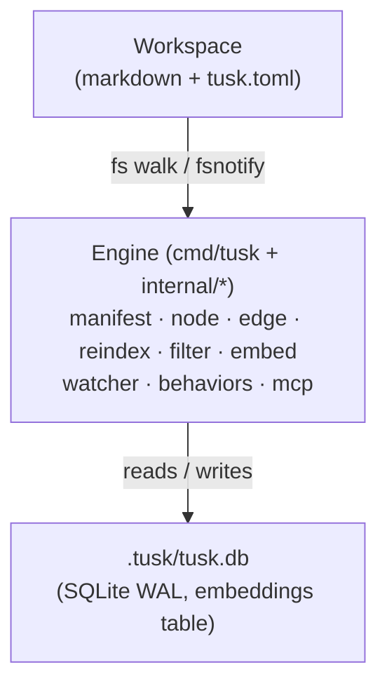

# Tusk

**A local-first agent brain.** Tusk turns a directory of markdown files into a
schema-validated, semantically-indexed graph — queryable from the CLI and from
any MCP-compatible agent (Claude Code, Cursor, etc.).

Files are the source of truth. Git is the history. Tusk is the indexer and the
retrieval engine.

```
markdown vault  ──▶  tusk indexer  ──▶  SQLite graph + embeddings
                                              │
                                              ├─▶ CLI       (tusk query, tusk node …)
                                              └─▶ MCP tools (tusk_query, tusk_node_create, …)
```

- **Local first.** No service to log in to. The index lives in `.tusk/` next to your files.
- **Schema-validated.** Node and edge types are declared in `tusk.toml`. Off-schema content is warned, never rejected.
- **Structural + semantic.** A compact filter grammar for the graph (`key=value` / `key:value`, ranges, edge traversal, boolean composition), Ollama-backed embeddings for similarity, and a hybrid mode that filters then ranks.
- **External edits are first-class.** Vim, Obsidian, an LLM piping markdown — they all work; the watcher keeps the index live.
- **One engine, two surfaces.** Every read/write graph verb has a 1:1 MCP tool; workspace bootstrap (`tusk init`) and the web app (`tusk web`, graph + reading views) stay CLI-only.

---

## Installation

### Prerequisites

- (Optional, for semantic search) [Ollama](https://ollama.com) running locally with an embedding model, e.g. `ollama pull nomic-embed-text`.

### One-liner (prebuilt binary)

```bash
curl -fsSL https://raw.githubusercontent.com/germanamz/tusk/main/install.sh | sh
```

Detects your OS/arch, downloads the latest GitHub release, drops the `tusk` binary into `~/.local/bin` (override with `INSTALL_DIR=/usr/local/bin`), and installs its man pages into `~/.local/share/man` (override with `MAN_DIR`; `man tusk` works once that dir is on your `MANPATH`). Pin a specific release with `TUSK_VERSION=v1.1.0`. Prebuilt archives ship for darwin/linux/windows on amd64 + arm64.

### From source

Requires Go 1.26+.

```bash
git clone https://github.com/germanamz/tusk
cd tusk
make build
# binary at ./bin/tusk — move it onto your PATH
install bin/tusk /usr/local/bin/tusk
```

Or, without cloning:

```bash
go install github.com/germanamz/tusk/cmd/tusk@latest
```

Verify:

```bash
tusk --version
```

### Updating

If you installed a prebuilt binary, `tusk update` replaces it in place. Your workspace and `.tusk/` index are untouched.

```bash
tusk update              # latest release
tusk update v1.2.0       # pin a version (or roll back to one)
tusk update --check      # report what's available, change nothing
```

The archive is verified against the release checksums before anything is extracted, and the previous binary is kept aside until the replacement is in place, so a failed swap rolls back rather than leaving you with no binary. Man pages are refreshed alongside it.

A binary managed by Homebrew, installed with `go install`, or built from source is owned by that tool, so `tusk update` refuses it and prints the right command instead (`--force` overrides):

```bash
# From source
cd tusk && git pull && make build && install bin/tusk /usr/local/bin/tusk

# go install
go install github.com/germanamz/tusk/cmd/tusk@latest
```

Re-running the install one-liner also still works, and remains the way to bootstrap a machine that has no `tusk` yet:

```bash
curl -fsSL https://raw.githubusercontent.com/germanamz/tusk/main/install.sh | sh
curl -fsSL https://raw.githubusercontent.com/germanamz/tusk/main/install.sh | TUSK_VERSION=v1.2.0 sh
```

After a major upgrade, run `tusk reindex` to pick up any indexer changes, then `tusk doctor` to confirm the workspace is healthy.

---

## Quickstart

> For per-command reference (flags, examples), see
> [docs/cli/](docs/cli/README.md). For multi-command recipes, see
> [docs/cli/workflows.md](docs/cli/workflows.md). Man pages are in [`man/`](man/) — `man -M man tusk` after cloning.

```bash
# 1. Initialize a workspace in the current directory
mkdir my-brain && cd my-brain
tusk init --name my-brain

# 2. Add a built-in type pack so you have some node types
tusk pack add vault     # note, meeting, decision + references/relates-to edges
tusk pack add tags      # tag node type + tagged edge
tusk pack add kanban    # ticket node type + workflow + parent/blocks edges

# 3. Create a node
tusk node create --path notes/hello.md --type note --title "Hello, Tusk"

# 4. Build the index (also runs after every CLI write)
tusk reindex

# 5. Query the graph
tusk node list 'type=note'
tusk query 'type=ticket status=active' --sort '+priority,-due'

# 6. Get a quick health check
tusk status
tusk doctor
```

---

## How information is structured

A Tusk workspace is just a directory:

```
my-brain/
├── tusk.toml                # workspace manifest (committed)
├── .tusk/                   # gitignored — local SQLite index
│   └── tusk.db
├── .gitignore
├── notes/
│   └── auth-rfc.md
├── tickets/
│   └── fix-login-bug.md
└── tags/
    └── auth.md
```

### Nodes are markdown files

Every `.md` file with a `type:` field in YAML frontmatter is a **node**. The file path (minus the extension) is the canonical **node id** — no separate id field.

```markdown
---
type: ticket
title: Fix login bug
status: active
priority: high
due: 2026-05-15
parent: tickets/auth-epic
blocks: [tickets/refactor-storage]
tags: [auth, security]
---

# Fix login bug

The bug occurs when users with SSO accounts hit the password reset flow.
See [[notes/auth-rfc]] for context.
```

- `type` is the only universally reserved key.
- Other frontmatter keys are either **properties** (string / int / date / enum / ref / list-of) or **edges** (declared in `tusk.toml`).
- `[[notes/auth-rfc]]` body wikilinks materialize as edges to that node id for any edge type declared with `wikilinks = true` (e.g. the `vault` pack's `references` edge). The Obsidian aliased form `[[notes/auth-rfc|the auth RFC]]` links to the same node id — the text after `|` is display only — and a `tusk node move` retargets the id while keeping the display text.

### Edges connect nodes

Edges are typed, declared in the manifest, and can be created two ways:

- **Frontmatter** — the natural place. `parent: tickets/auth-epic` declares a `parent` edge.
- **CLI / MCP** — `tusk edge add --type blocks --source tickets/a --target tickets/b`.

Edge declarations enforce legality (`from`/`to` types), cardinality, ordering, and optional `acyclic = true` (cycles are rejected at write time). A hand-edited file that breaks `from`/`to` or cardinality is still indexed, and `tusk doctor` reports the edge as an error.

### Pages name the files they describe

Technical pages name source files, usually in inline code. Set `paths = true` on an edge type and tusk records each inline-code span that is a workspace-relative path, with its line, so a file can find the pages that describe it:

```toml
[edge-types.describes]
from  = ["technical"]   # which pages are scanned
paths = true
```

```bash
# Which pages name this file (or a directory above it), and where?
tusk query 'names-path=server/ledger/core/service.go' --include paths
```

The source tree can stay in `[workspace] ignore`: a path ref targets a path, not a node. `tusk doctor` warns with `path-missing` when a page names a path that has been renamed or deleted, and the Claude Code plugin (`tusk claude install`) reminds the agent of those pages right after it edits the file.

### The manifest defines the schema

`tusk.toml` is the contract between you and the engine. A minimal manifest:

```toml
[workspace]
name = "my-brain"
ignore = ["bin/", "node_modules/", "*.test"]

[embeddings]
provider = "ollama"
endpoint = "http://localhost:11434"
model    = "nomic-embed-text"
dim      = 768

[node-types.note]
description = "A free-form markdown note"
properties = []

[node-types.decision]
description = "A captured decision"
properties = [
    { name = "decided-at",  type = "date", required = true },
    { name = "status",      type = "enum", values = ["proposed", "accepted", "rejected", "superseded"] },
    { name = "supersedes",  type = "ref",  to = "decision" },
]

[edge-types.references]
description = "Implicit edge materialized from body wikilinks"
from        = ["*"]
to          = ["*"]
cardinality = "many-to-many"
inverse     = "referenced-by"
```

`ref` properties auto-materialize edge types of the same name — declaring `supersedes` as a `ref` to `decision` gives you a `supersedes` edge for free.

### Rules: conventions doctor checks

Types and edges cover what a node may contain. A vault usually has conventions on top of that, like "product notes live under `docs/product/`". Write one as a filter that should match nothing:

```toml
[rule.domain-matches-directory]
description = "a product note lives under docs/product/"
filter      = "type=note AND domain=product AND NOT path=docs/product/**"

[rule.product-links-stay-in-product]
description = "a product page links only to product pages and the glossary"
filter      = "domain=product AND references-> (type=note AND NOT domain=product AND NOT id=docs/glossary)"
severity    = "warning"   # error (the default) | warning | advice
```

`tusk doctor` runs every rule and reports each matching node as a `rule:<name>` issue at the rule's severity, so a broken convention fails it like a dangling link would. The filter is the same grammar `tusk query` takes, so you can try it there first. Two differences: a rule matches file nodes only (sub-units share their file's `path`) unless the filter selects a sub-unit type such as `type=section`, and a rule's filter must name declared types, properties and enum values, because a typo there would match nothing and pass forever. A rule that fails those checks doesn't stop anything from loading; `tusk reload` lists it under warnings and `tusk doctor` reports it as a `rule-invalid` error.

Edited `tusk.toml` while a daemon is running? `tusk reload` (or the `tusk_reload` MCP tool) re-reads and validates the manifest, hot-swaps the schema in place — no restart — and converges any sibling daemons via the `.tusk/manifest-epoch` sentinel. It then reindexes to re-validate your content against the new schema. Validation matches startup, so a reload lands the same state a restart would.

### Type packs (built-in templates)

Instead of declaring everything by hand, `tusk pack add <name>` splices a curated TOML block into your manifest:

| Pack | Adds |
|------|------|
| `vault` | `note`, `meeting`, `decision`; `references` (wikilinks) + `relates-to` |
| `tags` | `tag` node + `tagged` edge (with `tags: [a, b]` frontmatter shorthand) |
| `kanban` | `ticket` node with workflow-validated `status`; `parent` (WBS) + `blocks` edges |
| `dev` | `spec`, `plan`, `handoff`, `package` — dogfooding pack for tracking software projects |

Packs compose: add `vault` + `tags` + `kanban` and you have notes, decisions, tags, and a kanban workflow on top.

```bash
tusk pack add vault
tusk pack add tags
tusk pack add kanban
```

You can also load a pack from a URL or local file:

```bash
tusk pack add https://example.com/packs/research.toml
tusk pack add file://$PWD/my-pack.toml
```

---

## Indexing

The index lives in `.tusk/tusk.db` (SQLite + WAL). It is **derived state** — delete `.tusk/` and `tusk reindex` rebuilds it identically.

### One-shot reindex

```bash
tusk reindex
# Reindex done: 142 indexed, 0 removed, 3 skipped
```

`reindex` walks the workspace, parses every `.md`, validates frontmatter against the manifest, resolves refs + wikilinks into edges, and enqueues embeddings.

### Live watcher

```bash
tusk watch
```

Runs fsnotify against the workspace and applies edits incrementally. Drains the embed queue in the background.

### What gets indexed

- Every `.md` file with a `type:` field, anywhere in the workspace.
- Every `.html` / `.htm` file with a `<meta name="tusk:type">` tag — indexed
  over its **prose** (tags stripped, entities decoded), with `<meta name="tusk:*">`
  becoming typed node properties and `data-*` attributes captured as lenient
  signals under the reserved `data` key.
- Filtered through `.gitignore` + `[workspace] ignore` patterns.
- `.tusk/` and `.git/` are always ignored.

Off-schema content is **warned, not rejected** — a file with an unknown `type:`, a property violation, or an edge its edge type forbids still gets indexed (so it stays queryable) and surfaces in `tusk doctor`. The exception is a file reindex cannot parse at all (frontmatter that does not decode, say): it stays out of the index, and `tusk doctor` reports it as a `skipped-file` error with the parse error. Plain markdown with no frontmatter or no `type:` is not a node and is never reported.

---

## Querying

### Structural filter

A compact filter grammar that compiles to parameterized SQL. Property
comparisons accept `=` or `:` interchangeably; the rest of the grammar uses
the operators below.

```bash
# Property predicates (`=` and `:` are equivalent)
tusk query 'type=ticket status=active priority=high'
tusk query 'type:plan shipped-at>=2026-04-01'   # date ordering, chronological

# Path patterns on path and id: * stays in one folder, ** crosses folders
tusk query 'type=note path=docs/product/*'      # notes directly in docs/product/
tusk query 'path=docs/** path!=docs/archive/**' # all of docs/ except the archive

# Edge traversal: -> outgoing, <- incoming
tusk query 'type=ticket blocks->type=ticket'        # tickets that block other tickets
tusk query 'type=note references<- type=spec'      # notes referenced by specs

# The one term after the arrow constrains the linked node; group for more
tusk query 'type=note references->(domain=technical OR domain=wip)'
tusk query 'domain=product references-> NOT domain=product'   # product notes linking outside product

# Multi-hop
tusk query 'type=ticket parent->parent->title="auth-epic"'

# Sort + pagination
tusk query 'type=ticket status=active' --sort '+priority,-due' --take 10
```

### Semantic search

Requires `[embeddings]` configured (Ollama by default). Embedding runs asynchronously after writes; until a node is embedded, it's invisible to semantic queries (and surfaces in `tusk doctor`).

```bash
tusk query '' --semantic "auth bug in password reset flow" --take 5
tusk query 'path=docs/**' --semantic "billing totals"   # scoped to docs/ and below
```

Each result carries `matched_units`, the passages that matched, best first. A passage folds into its innermost section, so one finding is one row: the section's id, `heading`, and `lines: [start, end]`, plus the passage's score and snippet. Lines are 1-based and counted from the top of the file, frontmatter included, so an agent can open the file at the passage instead of reading all of it (HTML units carry no lines). `--max-units N` keeps the best N per file, MCP keeps 3 unless told otherwise, and `units_total` says how many there were. `[workspace] line-numbering` decides what ends a line: `lf` (the default, matching sed and grep -n), `universal` (adds a lone CR, like most editors), or `unicode` (adds the Unicode line separators).

#### Matching the embedding model

Many embedding models are trained with an instruction prefix on each side, one for queries and another for documents. Ollama adds neither, so tusk lets you set them under `[embeddings]`, along with the chunk sizes and context window that suit the model:

```toml
[embeddings]
provider        = "ollama"
endpoint        = "http://localhost:11434"
model           = "nomic-embed-text"
dim             = 768
query-prefix    = "search_query: "
document-prefix = "search_document: "
```

| Model | `query-prefix` | `document-prefix` | Context window |
| --- | --- | --- | --- |
| `nomic-embed-text` | `search_query: ` | `search_document: ` | 2K in Ollama |
| `embeddinggemma` | `task: search result \| query: ` | `title: {title} \| text: ` | 2K |
| `mxbai-embed-large` | `Represent this sentence for searching relevant passages: ` | none | 512 |
| `snowflake-arctic-embed` (v1) | `Represent this sentence for searching relevant passages: ` | none | 512 |
| `snowflake-arctic-embed2` | `query: ` | none | 8K |

Each prefix ends with a space. `{title}` in `document-prefix` becomes the note's title (`none` for sub-units). The other keys are `document-header` (`full`, `title`, or `none`: how much frontmatter leads each file chunk), `chunk-target-bytes` / `chunk-max-bytes` / `chunk-overlap-bytes` (defaults 1600 / 4000 / 200, sized for a 2K window; for a 512-token model set `chunk-max-bytes = 1000` and a smaller target such as `chunk-target-bytes = 800`, and consider `document-header = "title"` since the header doesn't count toward the cap), and `num-ctx` (passed to Ollama as `num_ctx`).

Which settings work best depends on the model and on your notes, so try a few semantic queries before and after a change. Changing `query-prefix` takes effect on the next query. Changing any other key re-embeds every note. Apply the change with `tusk reload` (or `tusk_reload` from an agent) so a running MCP server picks up the new settings too; `tusk reindex` also applies it, but a server that hasn't reloaded stops embedding until it does, rather than embed with the old settings. `tusk doctor` suggests the prefixes when it recognizes one of the models above with them unset, and names the missing one when only one of a two-sided pair is set. If you've tried a prefix and decided against it, set it explicitly to `""` (for example `document-prefix = ""`) and doctor stops suggesting it.

### Hybrid (recommended for agents)

Structural filter narrows the candidate set; semantic similarity ranks within it.

```bash
tusk query 'type=ticket status=active' --semantic "login flow" --take 10
```

### JSON output

Add `--json` to any query for structured output that's easy to pipe into an LLM or a script.

```bash
tusk query 'type=decision' --semantic "storage backend" --top 3 --json
```

---

## MCP server (Claude Code, Cursor, …)

`tusk mcp` runs an MCP server backed by the same indexing engine as the CLI, exposing the graph verbs as tools. Agents should prefer these tools over shelling out to `tusk` — they run in the warm daemon with the index already open. Stdio is the default transport; SSE is available on a port.

```bash
tusk mcp                      # stdio (for Claude Code / Cursor / Codex)
tusk mcp --transport sse --addr :8765
```

It holds the workspace open for the lifetime of the session: a single SQLite handle, an embed-queue drainer, and an fsnotify watcher all live in the same process so the index stays warm across tool calls.

### Wiring it into Claude Code

Run this once in the workspace root (or pass `--claude` to `tusk init`):

```bash
tusk claude install
```

It writes a Claude Code plugin to `.claude/skills/tusk/`, which Claude Code loads for any session started in that folder. The plugin does two things:

- It runs the tusk MCP server, so the agent has the `tusk_*` tools. Claude Code holds a project plugin's server until each user approves it, so install approves it for you in `.claude/settings.local.json`, your uncommitted per-user settings. If `.mcp.json` already runs a tusk server, install removes that entry so the tools aren't registered twice.
- When a conversation starts, it adds a `tusk` block to the first message, next to CLAUDE.md. The block opens with a short orientation (the declared node types with counts, edge types, aliases, whether the index is current), followed by the `[context]` digest when `tusk.toml` declares one. `/clear` and compaction read it again. It's capped at `[context] max-bytes` (16384 by default); over that, alias sections go first, then recent nodes, then pinned ones. Run `tusk claude context` to see exactly what a session gets.

The plugin folder can be committed, so teammates get it on clone if they have `tusk` on their PATH. Each of them approves the MCP server once, by running `tusk claude install` or in `/mcp`. Run `tusk claude install` again after upgrading tusk, because sessions warn when the plugin is older than the binary. `tusk claude status` reports what's installed, and `tusk claude uninstall` removes it.

To wire up only the MCP server by hand:

```bash
claude mcp add tusk -- /usr/local/bin/tusk mcp
```

Or directly in `~/.claude.json`:

```json
{
  "mcpServers": {
    "tusk": {
      "command": "/usr/local/bin/tusk",
      "args": ["mcp"],
      "cwd": "/path/to/my-brain"
    }
  }
}
```

### Available MCP tools

| Tool | What it does |
|------|--------------|
| `tusk_status` | node counts by type, edge count, queue depth, last reindex |
| `tusk_doctor` | health check: every issue has a severity (`error` / `warning` / `advice`); `error_count > 0` means something is broken |
| `tusk_node_get` / `tusk_node_list` | read by id or filter |
| `tusk_node_render` | render a node's content as plain text (HTML tags / markdown markup stripped) |
| `tusk_node_create` / `tusk_node_modify` / `tusk_node_move` / `tusk_node_delete` | write |
| `tusk_edge_add` / `tusk_edge_remove` / `tusk_edge_list` | edge CRUD |
| `tusk_query` | structural + optional `semantic` ranking |
| `tusk_context` | composed warm-context digest (pinned nodes, recent activity, aliases) |
| `tusk_run` | invoke a manifest-declared alias by name |
| `tusk_reindex` | force a full walk |
| `tusk_reload` | hot-reload `tusk.toml`: validate + swap the schema, no restart |
| `tusk_reset` | drop and rebuild the index from files (`confirm: true`) |
| `tusk_pack_add` | merge a built-in type pack's node/edge types into `tusk.toml` and hot-reload the schema |

Workspace bootstrap (`tusk init`), the Claude Code plugin (`tusk claude …`) and the web app (`tusk web`, graph + reading views) stay CLI-only.

---

## Health and diagnostics

```bash
tusk status     # node counts, edge count, embed-queue depth, last reindex timestamp
tusk doctor     # health check; exits 1 when an error is present
```

Every doctor finding has a severity, and the report lists errors first. An `error` means the vault or the index is wrong: a dangling link, a property that breaks its declaration, a file reindex could not parse, a pinned id left behind by a rename. A `warning` means things are correct but degraded, such as a node missing from semantic results or a type you never declared. `advice` is a hint. `tusk doctor` exits 1 when an error is present, so you (or an agent) can run it after every edit and treat a non-zero exit as "I broke something". `--fail-on=warning` fails on warnings too; `--fail-on=never` always exits 0.

`doctor` is also the place to look when:

- semantic queries seem to be missing nodes → check the embed-queue depth and last error
- a wikilink points to nothing → dangling-ref warning surfaces it
- a manifest change just landed → re-validate every affected node
- a convention you declared as a `[rule.<name>]` is broken → each offending node is a `rule:<name>` issue

---

## Architecture

Single Go binary, single SQLite index, single embedding provider (Ollama for now).



- **Filesystem > index, always.** The index is a cache; if it is stale, wedged, or corrupt, run `tusk reset` (or the `tusk_reset` MCP tool with `confirm: true`) to drop and rebuild it from your files. The markdown files are the source of truth, so nothing is lost.
- **Stateless across machines.** Clone the vault, reindex, get an identical brain.
- **Single-writer, many-readers.** SQLite WAL + a workspace-wide advisory lock so `tusk mcp` and one-shot CLI calls coexist.

Product vision and design principles live in [`PRODUCT.md`](PRODUCT.md). Per-package notes live in [`docs/packages/`](docs/packages/).

---

## Development

```bash
make build        # ./bin/tusk
make test         # unit tests
make test-race    # with race detector
make vet
make lint         # golangci-lint
make fmt
```

See [`STYLE.md`](STYLE.md) for the codebase conventions and [`CONTRIBUTING.md`](CONTRIBUTING.md) for how to propose changes.

## License

[Apache 2.0](LICENSE)
